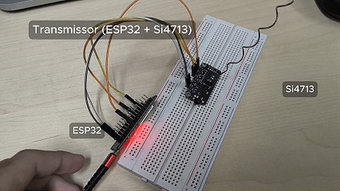
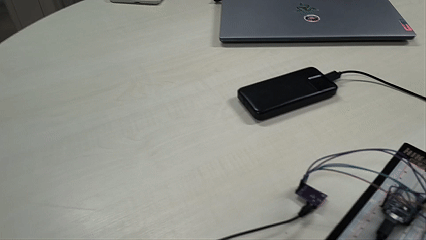
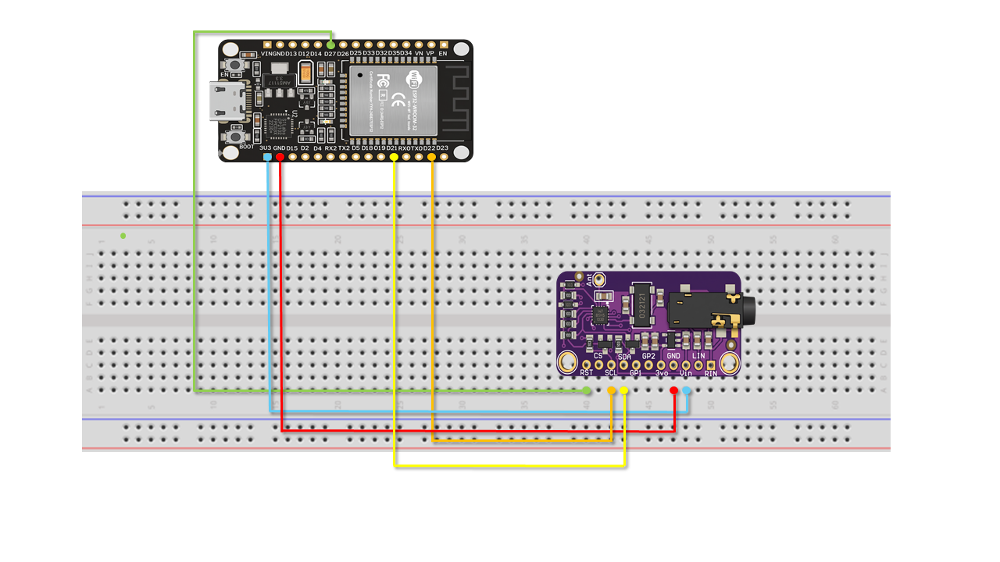
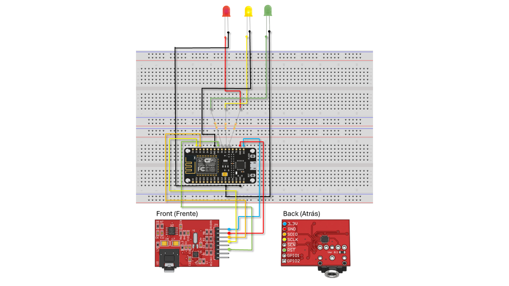

# rds-async-traffic_light
> *An experimental tool focused on the potential for integrating open-source RDS (Radio Data System) using IoT/embedded device principles, utilizing the 106.1 MHz frequency on the 57 kHz FM subcarrier via ESP32 and Python.*

# 🚦 Orquestração Semafórica via Protocolo RDS (Out-of-Band IoT)

[](https://www.gnu.org/licenses/gpl-3.0)
[](https://www.python.org/)
[](https://www.arduino.cc/)

<table>
  <tr>
    <td>
      
    </td>
    <td>
      
    </td>
  </tr>
</table>

Este repositório contém o código-fonte integral, esquemáticos e a documentação técnica da arquitetura analógica baseada em **Radio Data System (RDS)** para controle remoto de semáforos, apresentada ao Simpósio Brasileiro de Sistemas Multimídia e Web (WebMedia).

O objetivo deste projeto é demonstrar a viabilidade de operar infraestruturas urbanas críticas utilizando radiodifusão FM (VHF) como canal de contingência ou principal, garantindo a resiliência do sistema de trânsito independente de redes IP (Wi-Fi, 4G/5G, Fibra Óptica). 

Este repositório contém o código-fonte (software e firmware), diagramas e as instruções de replicação de hardware para o projeto de pesquisa **"Usando a Infraestrutura FM como Canal de Controle por RDS"**, submetido à SBC WEBMEDIA.

---

## ⚙️ Arquitetura do Sistema

O ecossistema é dividido em três camadas principais:
1. **Orquestrador (Python):** Interface gráfica que converte as ações de controle de tráfego em cargas úteis (*payloads*) otimizadas.
2. **Nó Transmissor / Gateway (ESP32 + Si4713):** Recebe os comandos via USB/Serial e os irradia na subportadora inaudível de 57 kHz da frequência FM (106.1 MHz).
3. **Nó Receptor / Atuador (ESP8266 + Si4703):** Ouve a frequência, extrai as *strings* RDS, processa-as em um Motor de Estados finito e atua sobre os LEDs do semáforo.

---

## 🛠️ Material Necessário

Para replicar este experimento em bancada, você precisará de:

**Transmissor (TX):**
- 1x Microcontrolador ESP32
- 1x Módulo Transmissor FM Si4713 (Adafruit)
- Jumpers e protoboard

**Receptor (RX):**
- 1x Microcontrolador ESP8266 (NodeMCU)
- 1x Módulo Receptor FM Si4703 (SparkFun)
- 1x Led de Arduino Amarelo
- 1x Led de Arduino Verde
- 1x Led de Arduino Vermelho
- Fone de ouvido barato (o fio atua como antena receptora no conector P2 do Si4703)

---

## 🔌 Esquema de Ligação (Pinagem)
Importante ressaltar, que para melhor visualização e didática, fizemos um diagrama ilustrativo visual no diretório `docs/esquematicos/`, contendo cada um das tabelas, os seus esquemáticos abaixo, bem como as suas respectivas tabelas neste manual de replicação, Ambos os módulos de rádio utilizam o barramento **I2C**. Conecte conforme a tabela:

### Ligações do Transmissor (ESP 32 + Si4713)
><p align="left">
>  
></p>
>
>| ESP32 (Host) | Si4713 (Módulo) | Função Técnica |
>| :--- | :--- | :--- |
>| **3V3** | `VIN` | Alimentação Elétrica (3.3V) |
>| **GND** | `GND` | Referência de Aterramento |
>| **D21** | `SDA` | Dados do Barramento I2C |
>| **D22** | `SCL` | Clock do Barramento I2C |
>| **D27** | `RST` | Controle de Reset de Hardware |

### Ligações do Receptor (ESP8266 + Si4703)
><p align="left">
>  
></p>
>
>Todas as conexões físicas do receptor, abrangendo o rádio e os atuadores luminosos, convergem para o mesmo microcontrolador. Siga o mapa >de fiação abaixo:
>
>| Pino ESP8266 (NodeMCU) | Componente Destino | Pino do Destino | Função Técnica / Observação |
>| :--- | :--- | :--- | :--- |
>| **3V3** | Rádio Si4703 | `VCC / VIN` | Alimentação elétrica (Exclusivo 3.3V) |
>| **GND** | Rádio Si4703 | `GND` | Referência de aterramento do módulo rádio |
>| **GND (Qualquer)** | Semáforo (LEDs)| `Cátodos (-)` | Retorno elétrico (perna curta dos 3 LEDs) |
>| **D1 (GPIO 5)** | Rádio Si4703 | `SCLK` | Clock do Barramento I2C |
>| **D2 (GPIO 4)** | Rádio Si4703 | `SDIO` | Dados do Barramento I2C |
>| **D5 (GPIO 14)**| Rádio Si4703 | `RST` | Reset de Hardware do Módulo FM |
>| **D6 (GPIO 12)**| Semáforo (LED) | `Anodo Verde` 🟢 | Atuador Lógico (Usar resistor em série) |
>| **D7 (GPIO 13)**| Semáforo (LED) | `Anodo Amarelo` 🟡 | Atuador Lógico (Usar resistor em série) |
>| **D8 (GPIO 15)**| Semáforo (LED) | `Anodo Vermelho` 🔴| Atuador Lógico (Usar resistor em série) |
>
> ⚠️ **Atenção à Tensão e Polaridade:**
> * Não ligue o pino VIN do rádio Si4703 nos 5V (VU ou VIN do ESP), pois isso queimará o CI do rádio instantaneamente.
> * **Ligação dos LEDs:** A perna mais longa de cada LED (Anodo) deve ser conectada aos pinos D6, D7 e D8 através de um resistor limitador (ex: 220Ω ou 330Ω) para proteger a porta lógica. A perna mais curta (Cátodo) de **todos os 3 LEDs** deve ser conectada aos slots **GND** disponíveis no ESP8266.

**Atenção:** Os módulos Si4703 e Si4713 operam em 3.3V. **Não** conecte no pino de 5V (VIN), sob risco de queimar os CIs.

---

## 🚀 Tutorial de Instalação

### Passo 1: 
1. Instale a [Arduino IDE](https://www.arduino.cc/en/software).
2. **Instalação de Drivers USB:** Certifique-se de que o seu sistema operacional possui os drivers adequados para comunicação serial. O NodeMCU (ESP8266) comumente requer o driver [**CP210x USB to UART Bridge da Silicon Labs**](https://www.silabs.com/software-and-tools/usb-to-uart-bridge-vcp-drivers?tab=downloads), se caso o driver inicial não funcionar, instale o [driver CH340](https://sparks.gogo.co.nz/ch340.html)
3. Abra a IDE do Arduino
4. Confirme as instalações das seguintes bibliotecas através do Library Manager localizado na IDE Arduino:
   * `Adafruit Si4713 Library` (Para o nó Transmissor)
   * `PU2CLR SI470X` (Para o nó Receptor)
5. Conecte o **ESP32**, abra o código presente na pasta `firmware/tx_gateway_esp32/tx_gateway_esp32.ino`, compile e faça o upload.
6. Conecte o **ESP8266**, abra o código presente na pasta `firmware/rx_atuador_esp8266/rx_atuador_esp8266.ino`, compile e faça o upload.

### ⚠️ Nota de Compilação e Conflitos I2C
Devido às diferenças arquitetônicas entre a família AVR tradicional e a família Espressif (ESP32/ESP8266), pode ocorrer um atropelamento na alocação dos pinos do barramento I2C por parte das bibliotecas originais.

**Caso o transceptor não seja detectado no monitor serial (Erro no ESP8266 + SI470X):**
1. Navegue até a pasta de bibliotecas da IDE do Arduino (geralmente em `Documentos/Arduino/libraries/`).
2. Dentro da pasta `libraries/src`, procure pela pasta `PU2CLR_SI470X` Abra o arquivo fonte `SI470X.cpp` da biblioteca do receptor.
3. Localize a instrução `Wire.end();` dentro do método de inicialização/setup e **comente-a** (adicionando `//` no início da linha). 
4. Salve o arquivo e recompile. Isso impedirá que a biblioteca encerre o barramento prematuramente e a obrigará a respeitar os pinos (`D2` e `D1`) definidos pelo seu *firmware*.

### 2. Rodando o Orquestrador (Software Python)
Recomenda-se o uso de um ambiente virtual (venv).
```bash
# Clone o repositório
git clone [https://github.com/SEU-USUARIO/rds-async-traffic_light.git](https://github.com/SEU-USUARIO/rds-async-traffic_light.git)
cd rds-async-traffic_light/software

# Instale as dependências
pip install -r requirements.txt
# (As dependências são: pyserial e customtkinter)

# Execute o orquestrador
python orquestrador.py
```

## Tutorial de operação
1. Conecte o ESP32 (Transmissor) na porta USB do computador
2. No orquestrador, selecione a porta COM correspondente e clique em **Conectar**.
3. O software realizará um handshake automático (`PING_ID`). Ao receber a assinatura do transmissor, os controles serão liberados
4. Ligue o ESP8266 (Receptor) em uma fonte de exergia externa (ou outro USB).
5. Clique nos botões da interface (ex: Ligar Verde). O ESP32 irradiará o dado, o ESP8266 decodificará o RDS pelo ar e o LED do semáforo mudará de estado em menos de 500 milissegundos conforme a tabela a seguir irá mostrar.

Os ensaios foram realizados em ambiente controlado. A tabela abaixo demonstra a latência de transição do motor de estados de acordo com a complexidade do *payload* injetado, intercalando-os com o comando de desligamento total (`000000`).

| Transmissão | Ligar Verde (ms) | Alerta Noturno (ms) | Ciclo Padrão (ms) |
| :---: | :---: | :---: | :---: |
| **1** | 205 | 237 | 426 |
| **2** | 269 | 214 | 395 |
| **3** | 282 | 217 | 365 |
| **4** | 194 | 205 | 390 |
| **5** | 342 | 228 | 456 |
| **6** | 159 | 294 | 510 |
| **7** | 261 | 280 | 384 |
| **8** | 208 | 277 | 371 |
| **9** | 253 | 218 | 376 |
| **10** | 158 | 188 | 459 |
| **Média** | **233,1** | **235,8** | **413,2** |

### ⚠️ Nota de analise do teste da tabela de latencia:
A análise evidencia a consistência operacional do sistema. Para instruções de acionamento imediato e alertas, observou-se uma latência média de `233,1 ms` e `235,8 ms`, respectivamente. Essa equivalência estatística decorre do fato de ambas as instruções utilizarem matrizes de decisão diretas de tamanho fixo (6 bytes), permitindo uma decodificação ágil. 

Por sua vez, a injeção do Ciclo Padrão apresentou um tempo médio de resposta de `413,2 ms`. Esse incremento de latência (≈ 178 ms) é atribuído ao custo computacional adicional exigido pelo *parser* do *firmware* no ESP8266, que necessita validar o prefixo `t`, fracionar a *string* dinâmica em três parâmetros independentes de tempo e reiniciar os contadores assíncronos baseados no temporizador de milissegundos da placa.

## 🔬 Notas de engenharia (Aprofundamento)
Durante o desenvolvimento deste protótipo, desafios técnicos foram superados. Devido às restrições de formatação do artigo, detalhamos abaixo as soluções de engenharia adotadas:

### O Desafio do Auto-Reset (DTR/RTS)
Por padrão em microcontroladores ESP/Arduino, abrir uma nova conexão serial via software altera os estados lógicos dos pinos DTR (Data Terminal Ready) e RTS (Request to Send). Isso aciona o circuito de reset físico da placa. Se isso ocorresse em nosso projeto, o barramento I2C que alimenta o rádio Si4713 reiniciaria e pararia de transmitir a cada comando injetado.

- Solução: Na biblioteca PySerial do orquestrador `Python`, implementamos o bloqueio explícito desses pinos logo antes de abrir a porta:
```bash
self.porta_serial.setDTR(False)
self.porta_serial.setRTS(False)
```

Isso permite que o ESP32 atue como um gateway ininterrupto, recebendo dados na Serial a 115.200 bps e repassando para o rádio sem piscar a CPU.

### Abstração e Fracionamento do Payload RDS
O RDS (Grupo 2A) exibe strings de 64 caracteres em rádios comerciais. No entanto, enviar 64 bytes exige múltiplos ciclos de transmissão, o que eleva a latência.
Para garantir o Soft Real-Time (latência < 500ms), definimos que o payload do sistema possui apenas 6 bytes.

- Comandos Estáticos: Como 110000 (Verde) ou 020202 (Alerta).
- Ciclos Síncronos Dinâmicos: Usamos o formato tXXYYZZ. O caractere t indica ao receptor que os próximos dígitos são os tempos do ciclo. Ex: t030103 significa "3s Verde, 1s Amarelo, 3s Vermelho". O nó de borda (ESP8266) faz o parser dessa string miúda e controla a temporização por conta própria.

## Citação
Se este projeto ou código for útil para sua pesquisa, por favor, considere citar o artigo originário:

```bibtex
@inproceedings{Sa2026RDS,
  title={Integração de Comandos Assíncronos via Protocolo RDS para Controle Remoto de Semáforos},
  author={Anonimo]},
  booktitle={Anais do XXXII Simpósio Brasileiro de Sistemas Multimídia e Web (WebMedia)},
  year={2026},
  publisher={SBC}
}
```

## 📄 Licença
Este projeto é licenciado sob a GNU General Public License v3.0.
Veja o arquivo LICENSE para mais detalhes. O uso acadêmico, modificação e distribuição são encorajados.
